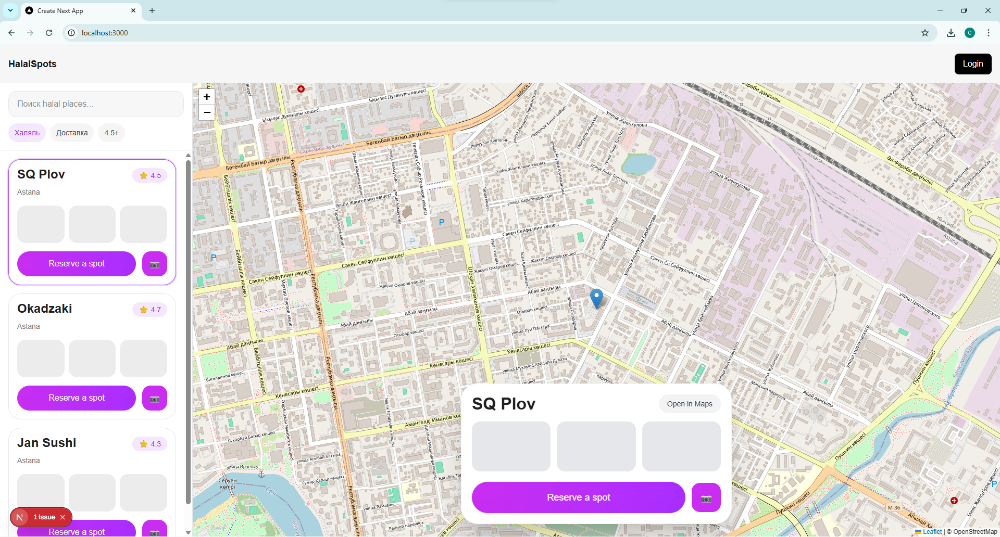

## Preview



# HalalSpots

A frontend web application for discovering halal places on a map.

## Features

- Interactive map (Leaflet)
- Search and filtering
- Place selection with map synchronization
- Modern UI inspired by 2GIS and custom Figma design

## Tech Stack

- Next.js
- TypeScript
- Tailwind CSS
- React Leaflet

## Getting Started

```bash
npm install
npm run dev
